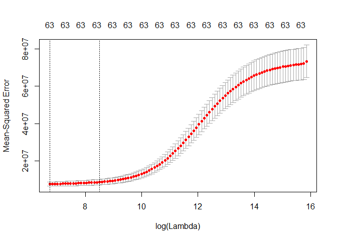

Car price prediction Ridge regression
================

Load the dataset

``` r
load("rda/carPrice.rda")
head(carPrice)
```

    ##   symboling  carCompany fueltype aspiration doornumber     carbody
    ## 1         3 alfa-romero      gas        std        two convertible
    ## 2         3 alfa-romero      gas        std        two convertible
    ## 3         1 alfa-romero      gas        std        two   hatchback
    ## 4         2        audi      gas        std       four       sedan
    ## 5         2        audi      gas        std       four       sedan
    ## 6         2        audi      gas        std        two       sedan
    ##   drivewheel enginelocation wheelbase carlength carwidth carheight
    ## 1        rwd          front      88.6     168.8     64.1      48.8
    ## 2        rwd          front      88.6     168.8     64.1      48.8
    ## 3        rwd          front      94.5     171.2     65.5      52.4
    ## 4        fwd          front      99.8     176.6     66.2      54.3
    ## 5        4wd          front      99.4     176.6     66.4      54.3
    ## 6        fwd          front      99.8     177.3     66.3      53.1
    ##   curbweight enginetype cylindernumber enginesize fuelsystem boreratio
    ## 1       2548       dohc           four        130       mpfi      3.47
    ## 2       2548       dohc           four        130       mpfi      3.47
    ## 3       2823       ohcv            six        152       mpfi      2.68
    ## 4       2337        ohc           four        109       mpfi      3.19
    ## 5       2824        ohc           five        136       mpfi      3.19
    ## 6       2507        ohc           five        136       mpfi      3.19
    ##   stroke compressionratio horsepower peakrpm citympg highwaympg price
    ## 1   2.68              9.0        111    5000      21         27 13495
    ## 2   2.68              9.0        111    5000      21         27 16500
    ## 3   3.47              9.0        154    5000      19         26 16500
    ## 4   3.40             10.0        102    5500      24         30 13950
    ## 5   3.40              8.0        115    5500      18         22 17450
    ## 6   3.40              8.5        110    5500      19         25 15250

Create a matrix "x" of all independent variables and store dependent variable in "y".

``` r
x <- model.matrix(price~.,data=carPrice)[,-1]
y <-carPrice$price
```

Divide you data in 70:30

``` r
set.seed(1)
train= sample(1:nrow(x), 0.7*nrow(x))
```

Store indices into test which is not present in train

``` r
test = (-train)
```

Dependend variable for test data

``` r
y.test = y[test]
```

library(glmnet)

Cross Validation to find lambda values

``` r
cv.out <- cv.glmnet(x[train,],y[train],alpha=0)
```

Plot crossvalidation output.

``` r
plot(cv.out)
```



Optimal lamda

``` r
minlamda <- cv.out$lambda.min

minlamda
```

    ## [1] 843.3589

Apply model on train dataset at lambda equal to minlamda

``` r
ridge.mod <- glmnet(x[train,],y[train],alpha=0,lambda =minlamda)
```

Prediction on test dataset

``` r
ridge.pred <- predict(ridge.mod,s=minlamda,newx=x[test,])
```

MSE with ridge

``` r
mean((ridge.pred-y.test)^2)
```

    ## [1] 4530257

Apply model on train dataset at lambda equal to zero, LR without regularisation

``` r
ridge.mod <- glmnet(x[train,],y[train],alpha=0,lambda = 0)
```

Linear Regression model

``` r
ridge.pred_0 <- predict(ridge.mod,s=0,newx=x[test,])
```

MSE Linear regression model

``` r
mean((ridge.pred_0-y.test)^2)
```

    ## [1] 9109487

Final model Coefficents

``` r
ridge_coef <-predict(ridge.mod,type="coefficients",s=minlamda)
ridge_coef
```

    ## 65 x 1 sparse Matrix of class "dgCMatrix"
    ##                                     1
    ## (Intercept)             -24479.530053
    ## symboling                 -578.543774
    ## carCompanyaudi           -2107.913688
    ## carCompanybmw            -1512.595816
    ## carCompanychevrolet      -7280.065593
    ## carCompanydodge          -9730.762739
    ## carCompanyhonda          -7739.243955
    ## carCompanyisuzu          -7905.564590
    ## carCompanyjaguar        -10738.379301
    ## carCompanymazda          -5798.662698
    ## carCompanymercedes-benz  -3764.909963
    ## carCompanymercury        -7531.316245
    ## carCompanymitsubishi    -11111.328104
    ## carCompanynissan         -5960.492645
    ## carCompanypeugot          3041.205885
    ## carCompanyplymouth       -9734.484267
    ## carCompanyporsche        -3977.113627
    ## carCompanyrenault        -8651.222095
    ## carCompanysaab           -3761.521144
    ## carCompanysubaru         -7867.273309
    ## carCompanytoyota         -7019.007831
    ## carCompanyvolkswagen     -5742.988582
    ## carCompanyvolvo         -10814.536590
    ## fueltypegas              -3854.842146
    ## aspirationturbo           1955.366071
    ## doornumbertwo               84.388667
    ## carbodyhardtop            1010.926758
    ## carbodyhatchback         -1049.195932
    ## carbodysedan               153.025389
    ## carbodywagon              -313.456811
    ## drivewheelfwd              672.885128
    ## drivewheelrwd             1517.490883
    ## enginelocationrear        7067.088321
    ## wheelbase                  168.389981
    ## carlength                 -235.739118
    ## carwidth                   692.849229
    ## carheight                 -382.203313
    ## curbweight                  12.329593
    ## enginetypedohcv          -1696.380604
    ## enginetypel             -11088.330652
    ## enginetypeohc             4204.618489
    ## enginetypeohcf            5043.990541
    ## enginetypeohcv           -5228.881614
    ## enginetyperotor            994.975003
    ## cylindernumberfive      -10279.214109
    ## cylindernumberfour       -4037.561917
    ## cylindernumbersix        -3679.622531
    ## cylindernumberthree      16764.096801
    ## cylindernumbertwelve     -5223.155843
    ## cylindernumbertwo        -3972.634190
    ## enginesize                 123.763043
    ## fuelsystem2bbl            2446.692968
    ## fuelsystem4bbl            8424.729785
    ## fuelsystemidi            -1210.373720
    ## fuelsystemmfi                .       
    ## fuelsystemmpfi            1769.626971
    ## fuelsystemspdi            1829.142723
    ## fuelsystemspfi            -385.507867
    ## boreratio                -3172.831777
    ## stroke                   -1721.849098
    ## compressionratio          -183.046086
    ## horsepower                 -41.937872
    ## peakrpm                      3.569884
    ## citympg                     47.749249
    ## highwaympg                  54.362042
