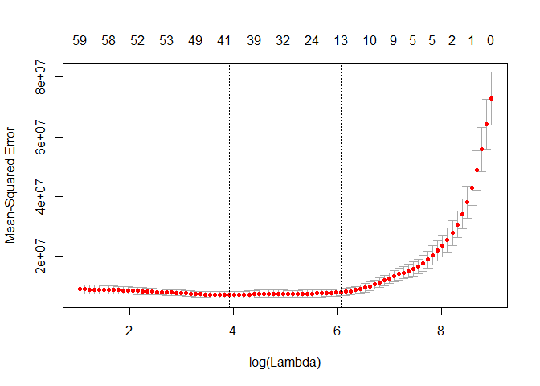

Carprice prediction Lasso Regression
================
January 24, 2019

Load the data

``` r
load("rda/carPrice.rda")
```

library(glmnet)

Create a matrix "x" of all independent variables and store dependent variable in "y".

``` r
x <- model.matrix(price~.,data=carPrice)[,-1]
y <-carPrice$price
```

Divide you data in 70:30

``` r
set.seed(1)
train= sample(1:nrow(x), 0.7*nrow(x))
```

Store indices into test which is not present in train

``` r
test = (-train)
```

Dependend variable for test data

``` r
y.test = y[test]
```

Crossvalidation for finding the lambda values

``` r
cv.out <- cv.glmnet(x[train,],y[train],alpha=1)
plot(cv.out)
```



Optimal lamda store it into "minlamda\_lasso" object

``` r
minlamda_lasso <-cv.out$lambda.min
minlamda_lasso
```

    ## [1] 50.55804

But when we check in the plot, MSE value is constant upto log(6) \#6= log(lambda). Working with value equivalent to log lambda =6 will help to eliminate some redundant variable is an advantage.

Lambda equivalent to log lambda = 6

``` r
lambda <- exp(6)
lambda
```

    ## [1] 403.4288

Modeling

``` r
lasso.mod <- glmnet(x[train,],y[train],alpha=1,lambda = 403.4)
```

Prediction

``` r
lasso.pred <- predict(lasso.mod,s= 403.4,newx=x[test,])
```

MSE

``` r
mean((lasso.pred-y.test)^2)
```

    ## [1] 6480779

All the coefficents from the model at optimal lamda, s=403.4

``` r
lasso.coef <- predict(lasso.mod,type="coefficients",s=403.4)
lasso.coef
```

    ## 65 x 1 sparse Matrix of class "dgCMatrix"
    ##                                     1
    ## (Intercept)             -32376.420860
    ## symboling                    .       
    ## carCompanyaudi               .       
    ## carCompanybmw             5476.945846
    ## carCompanychevrolet          .       
    ## carCompanydodge              .       
    ## carCompanyhonda              .       
    ## carCompanyisuzu              .       
    ## carCompanyjaguar             .       
    ## carCompanymazda              .       
    ## carCompanymercedes-benz   4394.739442
    ## carCompanymercury            .       
    ## carCompanymitsubishi      -228.632583
    ## carCompanynissan          -559.445212
    ## carCompanypeugot             .       
    ## carCompanyplymouth           .       
    ## carCompanyporsche         2799.236344
    ## carCompanyrenault            .       
    ## carCompanysaab               .       
    ## carCompanysubaru             .       
    ## carCompanytoyota             .       
    ## carCompanyvolkswagen         .       
    ## carCompanyvolvo              .       
    ## fueltypegas                  .       
    ## aspirationturbo              .       
    ## doornumbertwo                .       
    ## carbodyhardtop               .       
    ## carbodyhatchback          -174.074806
    ## carbodysedan                 .       
    ## carbodywagon                 .       
    ## drivewheelfwd                .       
    ## drivewheelrwd             1422.239768
    ## enginelocationrear        5542.015048
    ## wheelbase                    .       
    ## carlength                    .       
    ## carwidth                   457.841142
    ## carheight                    .       
    ## curbweight                   1.725973
    ## enginetypedohcv              .       
    ## enginetypel                  .       
    ## enginetypeohc                .       
    ## enginetypeohcf               .       
    ## enginetypeohcv               .       
    ## enginetyperotor              .       
    ## cylindernumberfive           .       
    ## cylindernumberfour       -1378.247822
    ## cylindernumbersix            .       
    ## cylindernumberthree          .       
    ## cylindernumbertwelve         .       
    ## cylindernumbertwo            .       
    ## enginesize                  74.264085
    ## fuelsystem2bbl               .       
    ## fuelsystem4bbl               .       
    ## fuelsystemidi                .       
    ## fuelsystemmfi                .       
    ## fuelsystemmpfi               .       
    ## fuelsystemspdi               .       
    ## fuelsystemspfi               .       
    ## boreratio                    .       
    ## stroke                       .       
    ## compressionratio             .       
    ## horsepower                  17.272555
    ## peakrpm                      .       
    ## citympg                      .       
    ## highwaympg                   .

Non zero coefficients in final model

``` r
lasso.coef <- predict(lasso.mod,type="coefficients",s=403.4)[1:65,]
lasso.coef[lasso.coef!=0]
```

    ##             (Intercept)           carCompanybmw carCompanymercedes-benz 
    ##           -32376.420860             5476.945846             4394.739442 
    ##    carCompanymitsubishi        carCompanynissan       carCompanyporsche 
    ##             -228.632583             -559.445212             2799.236344 
    ##        carbodyhatchback           drivewheelrwd      enginelocationrear 
    ##             -174.074806             1422.239768             5542.015048 
    ##                carwidth              curbweight      cylindernumberfour 
    ##              457.841142                1.725973            -1378.247822 
    ##              enginesize              horsepower 
    ##               74.264085               17.272555
